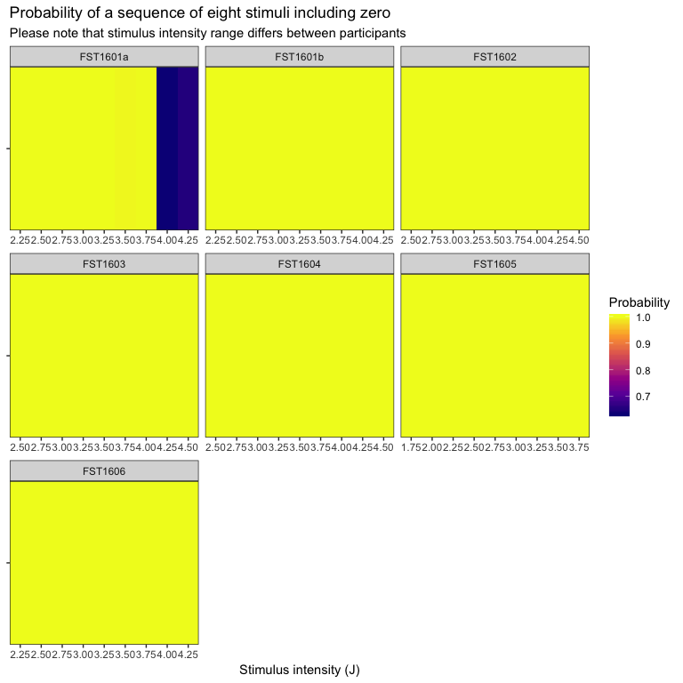
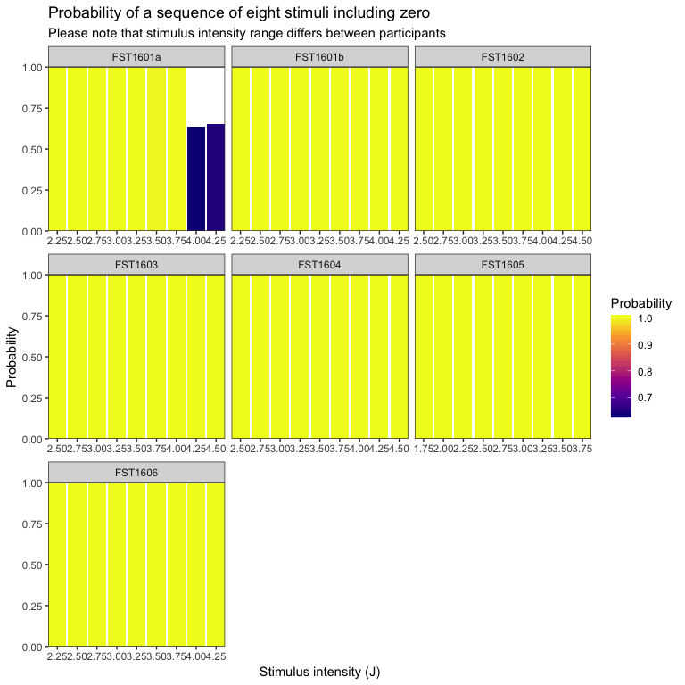

----

## Question
For each stimulus intenisty, what is the probability that the set of eight repeated stimuli include zero?

To answer this question, we generated 1999 resamples (with replacement) of n = 8 intensity ratings at each stimulus intensity for each study participant. We then counted how many of these resamples included zero. 

The binomial distribution estimates that extreme values for a sequence of eight repeats crossing zero is $x \leq$ 1 or $x \geq$ 7, when the probability of crossing zero for each trial is _p_ = 0.5 (i.e., there is an even chance that a rating will be above or below zero). This assumption does not take into account that as the stimulus intensity becomes more extreme (in either direction) the probability probably of a sequence of ratings inclusing zero probably becomes less. 

----

## Import and inspect data


```r
# Import
data <- read_rds('data/SPARS_B.rds')

# Inspect
glimpse(data)
```

```
## Observations: 2,149
## Variables: 10
## $ PID            <chr> "FST1601a", "FST1601b", "FST1602", "FST1603", "...
## $ block          <int> 1, 1, 1, 1, 1, 1, 1, 1, 1, 1, 1, 1, 1, 1, 1, 1,...
## $ trial_number   <int> 1, 1, 1, 1, 1, 1, 1, 2, 2, 2, 2, 2, 2, 2, 3, 3,...
## $ intensity      <dbl> 3.75, 2.75, 4.25, 3.00, 3.50, 2.50, 2.25, 4.00,...
## $ intensity_rank <int> 7, 3, 8, 3, 5, 4, 1, 8, 3, 3, 8, 3, 6, 4, 4, 8,...
## $ scale          <chr> "SPARS", "SPARS", "NRS", "SRS", "SRS", "SPARS",...
## $ scale_combined <chr> "SPARS", "SPARS", "COMBINED", "COMBINED", "COMB...
## $ rating         <dbl> 3, 1, 9, -78, -32, 17, 27, 4, 5, 7, 0, -69, 9, ...
## $ rating_eq      <dbl> 3.0, 1.0, 4.5, -39.0, -16.0, 17.0, 13.5, 4.0, 5...
## $ rating_z       <dbl> 0.5043367, 0.4190808, -0.3963035, -0.6689292, 0...
```

----

## Resample data and calculate simple probability


```r
# Nest in preparation for resampling by intenisty within each participant
data_boot <- data %>%
    # Select columns
    select(PID, intensity, rating) %>% 
    # Group and nest
    group_by(PID, intensity) %>%
    nest()

# Define a bootstrap function to determine whether the resampled set includes zero
boot_func <- function(d, i) {
    # Generate resample
    data <- d[i, ]
    # Extract rating data form resample
    rating <- data$rating
    # Determine min and max values of the ratings
    min <- min(rating, na.rm = TRUE)
    max <- max(rating, na.rm = TRUE)
    # If the range includes zero, mark as TRUE
    ifelse(min <= 0 & max >= 0,
           yes = TRUE,
           no = FALSE)
}

# Resample
data_boot %<>% 
    mutate(resample = map(.x = data, 
                          # Resample
                          ~ boot(data = .x,
                                 statistic = boot_func,
                                 R = 1999,
                                 stype = 'i') %>% 
                              # Extract resample outputs
                              .$t %>% 
                              as.vector(.) %>% 
                              data.frame(crosses_zero = .) %>% 
                              # Calculate simple probability
                              summarise(cross = sum(crosses_zero),
                                        total = nrow(.),
                                        probability = cross / total)))

# Extract probability
data_boot %<>%
    mutate(probability = map_dbl(.x = resample,
                                 ~ .x$probability))
```

----

## Plot

### Prepare data


```r
plot_data <- data_boot %>% 
    select(PID, intensity, probability)
```

### Heatmap


```r
# Draw heatmap of probabilities across stimulus intensities
ggplot(data = plot_data) +
    aes(x = intensity,
        y = 'ID',
        fill = probability) +
    geom_tile() +
    labs(title = 'Probability of a sequence of eight stimuli including zero',
         subtitle = 'Please note that stimulus intensity range differs between participants',
         x = 'Stimulus intensity (J)') +
    scale_x_continuous(breaks = seq(1, 4.5, by = 0.25),
                       expand = c(0, 0)) +
    scale_y_discrete(expand = c(0, 0)) +
    scale_fill_viridis_c(name = 'Probability',
                         option = 'C') +
    facet_wrap(~ PID,
               ncol = 3,
               scales = 'free_x') +
    theme(axis.title.y = element_blank(),
          axis.text.y = element_blank(),
          panel.grid = element_blank())
```




### Barplot


```r
# Draw a barplot of probabilities across stimulus intensities
ggplot(data = plot_data) +
    aes(x = intensity,
        y = probability,
        fill = probability) +
    geom_col() +
    labs(title = 'Probability of a sequence of eight stimuli including zero',
         subtitle = 'Please note that stimulus intensity range differs between participants',
         x = 'Stimulus intensity (J)',
         y = 'Probability') +
    scale_x_continuous(breaks = seq(1, 4.5, by = 0.25),
                       expand = c(0, 0)) +
    scale_y_continuous(limits = c(0, 1),
                       expand = c(0, 0)) +
    scale_fill_viridis_c(name = 'Probability',
                         option = 'C') +
    facet_wrap(~ PID, 
               ncol = 3,
               scales = 'free_x') +
    theme(panel.grid = element_blank())
```



----

## Session information


```r
sessionInfo()
```

```
## R version 3.5.1 (2018-07-02)
## Platform: x86_64-apple-darwin15.6.0 (64-bit)
## Running under: macOS High Sierra 10.13.6
## 
## Matrix products: default
## BLAS: /Library/Frameworks/R.framework/Versions/3.5/Resources/lib/libRblas.0.dylib
## LAPACK: /Library/Frameworks/R.framework/Versions/3.5/Resources/lib/libRlapack.dylib
## 
## locale:
## [1] en_GB.UTF-8/en_GB.UTF-8/en_GB.UTF-8/C/en_GB.UTF-8/en_GB.UTF-8
## 
## attached base packages:
## [1] stats     graphics  grDevices utils     datasets  methods   base     
## 
## other attached packages:
##  [1] bindrcpp_0.2.2  boot_1.3-20     magrittr_1.5    forcats_0.3.0  
##  [5] stringr_1.3.1   dplyr_0.7.6     purrr_0.2.5     readr_1.1.1    
##  [9] tidyr_0.8.1     tibble_1.4.2    ggplot2_3.0.0   tidyverse_1.2.1
## 
## loaded via a namespace (and not attached):
##  [1] Rcpp_0.12.18      cellranger_1.1.0  pillar_1.3.0     
##  [4] compiler_3.5.1    plyr_1.8.4        bindr_0.1.1      
##  [7] tools_3.5.1       digest_0.6.15     viridisLite_0.3.0
## [10] lubridate_1.7.4   jsonlite_1.5      evaluate_0.11    
## [13] nlme_3.1-137      gtable_0.2.0      lattice_0.20-35  
## [16] pkgconfig_2.0.1   rlang_0.2.1       cli_1.0.0        
## [19] rstudioapi_0.7    yaml_2.2.0        haven_1.1.2      
## [22] withr_2.1.2       xml2_1.2.0        httr_1.3.1       
## [25] knitr_1.20        hms_0.4.2         rprojroot_1.3-2  
## [28] grid_3.5.1        tidyselect_0.2.4  glue_1.3.0       
## [31] R6_2.2.2          readxl_1.1.0      rmarkdown_1.10   
## [34] modelr_0.1.2      codetools_0.2-15  backports_1.1.2  
## [37] scales_0.5.0.9000 htmltools_0.3.6   rvest_0.3.2      
## [40] assertthat_0.2.0  colorspace_1.3-2  labeling_0.3     
## [43] stringi_1.2.4     lazyeval_0.2.1    munsell_0.5.0    
## [46] broom_0.5.0       crayon_1.3.4
```
