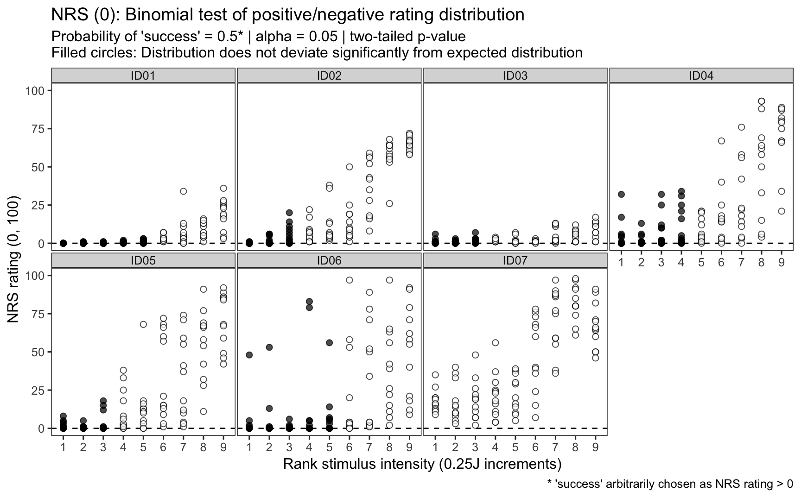
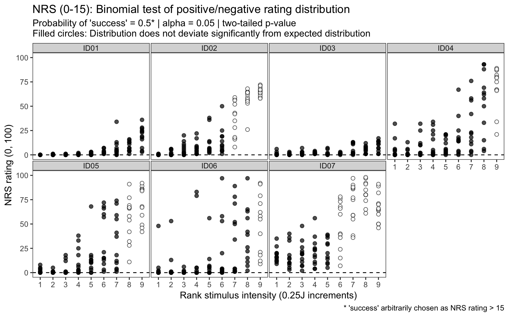

----

# Question
For each participant, and at each stimulus intensity, does the distribution of SPARS or NRS ratings differ significantly from a theoretical 'NULL' distribution?

To answer the question, we used the binomial test. The binomial test is an exact test of the statistical significance of deviations from a theoretically expected distribution of observations into two categories. As such, using the test required that we dichotomize the continuous rating data we collected (generally not a good thing, but here it is appropriate). 

The SPARS ranges from -50 ('no sensation') to +50 ('most intense pain you can imagine'), and therefore ratings can span 0 (pain threshold, 'the exact point at which you feel transitions to pain'). We therefore coded SPARS ratings < 0 as being **'negative'**, and ratings > 0 as being **'positive'**. In the first SPARS experiment (SPARS A), participants were not allowed to record a stimulus as 0 , but in the second SPARS experiment (SPARS B), they could record stimuli as 0 on the scale. We felt that the 0 ratings in the SPARS B experiment were uninformative, and so we excluded ratings of 0 from the analysis (we describe the number of zero ratings per participant below). 
The NRS ranges from 0 ('no pain') to 100 ('most intense pain you can imagine'), and therefore ratings immediately to the right of the 0-point of the scale mark the transition from non-painful to painful sensation. We therefore coded NRS ratings = 0 as being **'negative'**, and ratings > 0 as being **'positive'**. In addition, it has been reported that individuals use the first 15 points of a 0 to 100 NRS to record non-painful stimuli (NEEDS A REFERENCE), and so we also analysed the NRS data with NRS ratings $\leq$ 15 as being **'negative'**, and ratings >15 as being **'positive'**. 

In all cases, we modelled the data using the binomial test with a 50% probability of 'success' (positive rating arbitrarily chosen as success). This is a conservative approach as one would expect that for the SPARS and the NRS, as stimulus intensity increases above pain threshold, the probability of recording a 'positive' rating increases. Similarly, in the case of the SPARS (which allows the rating of intensity of noxious and non-noxious stimuli), one would expect that the probability of recording a 'negative' rating would increase as stimulus intensity decreased. However, since we did not know the approximate intensity of a theshold stimulus, and there was high inter-individual variation in sensitivity, we were unable to gage at which stimulus intensities we should start shifting the probability of 'success' away from 50% (see Supplement 1 and Supplement 2). 

Because ratings on the SPARS can range from -50 to +50, we analysed the data using a two-tailed p-value. That is, the distribution may shift to the left or right of the theoretical distribution. However, because the NRS has a floor rating of 0 ('no pain'), the change in rating from 0 is unidirectional (> 0), so we performed the binomial test with a one-tailed p-value. For all test, significance was assessed at the $\alpha$ = 0.05 level. And, because this was an exploratory analysis, we did not make any family-wide corrections for multiple comparisons. 

----

# SPARS A

## Import and inspect data


```r
# Import
data_sparsA <- read_rds('data-cleaned/SPARS_A.rds')

# Inspect
glimpse(data_sparsA)
```

```
## Observations: 1,927
## Variables: 6
## $ PID          <chr> "ID01", "ID01", "ID01", "ID01", "ID01", "ID01", "...
## $ block        <chr> "A", "A", "A", "A", "A", "A", "A", "A", "A", "A",...
## $ block_order  <dbl> 4, 4, 4, 4, 4, 4, 4, 4, 4, 4, 4, 4, 4, 4, 4, 4, 4...
## $ trial_number <dbl> 79, 80, 81, 82, 83, 84, 85, 86, 87, 88, 89, 90, 9...
## $ intensity    <dbl> 3.00, 2.25, 4.00, 3.25, 2.75, 2.25, 2.75, 4.00, 2...
## $ rating       <dbl> -40, -25, 10, 2, -10, -25, -20, 10, -25, -50, -25...
```

```r
data_sparsA %>% 
    select(intensity, rating) %>% 
    skim()
```

```
## Skim summary statistics
##  n obs: 1927 
##  n variables: 2 
## 
## ── Variable type:numeric ───────────────────────────────────────────────────────────────
##   variable missing complete    n  mean    sd  p0    p25 p50   p75 p100
##  intensity       0     1927 1927  2.47  0.93   1   1.75 2.5  3.25    4
##     rating       0     1927 1927 -4.45 22.31 -50 -20    2   10      45
##      hist
##  ▇▇▃▇▃▇▃▇
##  ▃▁▂▃▇▅▂▁
```

## Binomial test


```r
# Select columns
data_sparsA %<>%
    select(PID, intensity, rating)

# Nest data by PID and stimulus intensity
sparsA_nest <- data_sparsA %>% 
    group_by(PID, intensity) %>% 
    nest() 

# Generate data
sparsA_nest %<>% 
    # Add probability of success column
    mutate(prob = 0.5) %>% 
    # Extract rating data from dataframe
    mutate(data_vec = map(.x = data,
                          ~ .$rating)) %>% 
    # Recode rating data as categories according to sign
    mutate(data_cat = map(.x = data_vec,
                          ~ ifelse(.x < 0,
                                   yes = 'negative',
                                   no = 'positive'))) %>% 
    # Count the number of positive and negative ratings
    ## positive numbers arbitrarily listed first == 'success'
    mutate(success_count = map(.x = data_cat,
                           ~ c(length(.x[.x == 'positive']), 
                               length(.x[.x == 'negative'])))) %>% 
    # Conduct binomial test (two-sided)
    mutate(binomial_test = map2(.x = success_count,
                                .y = prob,
                                ~ binom.test(x = .x, 
                                             p = .y,
                                             alternative = 'two.sided'))) %>% 
    # Extract p-value from binomial_test
    mutate(binomial_p.value = map(.x = binomial_test,
                                 ~ .x$p.value %>%
                                     round(., 3))) %>% 
    # Categorise p-value using a p < 0.05 threshold
    ## Significant: distribution deviates significantly 
    ## from the theoretical distribution
    ## No correction for multiple comparisons 
    ## (too conservative for explorartory analysis)
    mutate(significant_p.value = map(.x = binomial_p.value,
                                     ~ ifelse(.x < 0.05,
                                              yes = 'yes',
                                              no = 'no')))
```

## Plot 

For each paticipant, we plotted raw SPARS ratings at each stimulus intensity and colour-coded the data according to whether the p-value returned by the binomial test was significant (distribution of data points deviates significantly from the theoretical expected distribution). 


```r
sparsA_nest %>% 
    # Select data columns
    select(PID, intensity, significant_p.value) %>% 
    # Unnest data
    unnest() %>% 
    # Join with original data
    right_join(data_sparsA) %>% 
    # Reclass intensity as an ordered factor
    mutate(intensity = factor(intensity, 
                              ordered = TRUE)) %>% 
    # Plot
    ggplot(data = .) +
    aes(x = intensity,
        y = rating,
        fill = significant_p.value) +
    geom_hline(yintercept = 0,
               linetype = 2) +
    geom_point(colour = '#000000',
               shape = 21,
               size = 2,
               alpha = 0.7) + 
    labs(title = "SPARS A: Binomial test of positive/negative rating distribution",
         subtitle = "Probability of 'success' = 0.5* | alpha = 0.05 | two-tailed p-value\nFilled circles: Distribution does not deviate significantly from expected distribution",
         caption = "* 'success' arbitrarily chosen as a positive SPARS ratings",
         x = 'Stimulus intensity (J)',
         y = 'SPARS rating (-50, 50)') +
    scale_x_discrete(breaks = seq(from = 1, 
                                  to = 4, 
                                  by = 0.5),
                     labels = sprintf('%.2f', seq(from = 1, 
                                                  to = 4, 
                                                  by = 0.5))) +
    scale_y_continuous(limits = c(-50, 50),
                       breaks = c(-50, -25, 0, 25, 50),
                       labels = c(-50, -25, 0, 25, 50)) +
    scale_fill_manual(values = c('#000000', '#FFFFFF')) +
    facet_wrap(~ PID, ncol = 4) +
    theme(legend.position = 'none',
          panel.grid = element_blank(),
          panel.spacing = unit(0.1, 'lines'),
          strip.text = element_text(margin = margin(t = 0.1, 
                                                    b = 0.1, 
                                                    r = 1, 
                                                    l = 1, 
                                                    'lines')),
          axis.text.x = element_text(angle = -90, 
                                     vjust = 0.5))
```


----

# SPARS B

## Import and inspect data


```r
# Import
data_sparsB <- read_rds('data-cleaned/SPARS_B.rds') %>% 
    # Extract trials rated using the SPARS
    filter(scale == 'SPARS') %>% 
    # Remove <NA>
    filter(!is.na(rating))

# Rank stimulus intensity
data_sparsB %<>%
    group_by(PID, scale) %>% 
    arrange(intensity) %>% 
    mutate(intensity_rank = dense_rank(intensity)) %>% 
    select(-intensity) %>% 
    rename(intensity = intensity_rank) %>% 
    ungroup()

# Inspect
glimpse(data_sparsB)
```

```
## Observations: 752
## Variables: 6
## $ PID          <chr> "ID06", "ID06", "ID06", "ID06", "ID06", "ID06", "...
## $ block_number <int> 1, 1, 1, 2, 2, 2, 3, 3, 3, 4, 4, 4, 1, 1, 1, 2, 2...
## $ trial_number <int> 4, 6, 27, 9, 13, 20, 20, 24, 27, 4, 18, 22, 5, 16...
## $ scale        <chr> "SPARS", "SPARS", "SPARS", "SPARS", "SPARS", "SPA...
## $ rating       <dbl> -49, 2, -6, 3, -20, -2, -31, 2, -5, -8, -23, 14, ...
## $ intensity    <int> 1, 1, 1, 1, 1, 1, 1, 1, 1, 1, 1, 1, 2, 2, 2, 2, 2...
```

```r
data_sparsB %>% 
    select(intensity, rating) %>% 
    skim()
```

```
## Skim summary statistics
##  n obs: 752 
##  n variables: 2 
## 
## ── Variable type:integer ───────────────────────────────────────────────────────────────
##   variable missing complete   n mean   sd p0 p25 p50 p75 p100     hist
##  intensity       0      752 752    5 2.58  1   3   5   7    9 ▇▅▅▅▃▅▅▃
## 
## ── Variable type:numeric ───────────────────────────────────────────────────────────────
##  variable missing complete   n  mean    sd  p0 p25 p50 p75 p100     hist
##    rating       0      752 752 -8.83 23.46 -50 -26  -4   5   50 ▆▂▃▇▇▃▁▁
```

```r
# Number of 0 ratings
data_sparsB %>%
    # Retain ratings of 0
    filter(rating == 0) %>% 
    # Select columns
    select(PID, intensity, rating) %>% 
    # Group by individual and intensity
    group_by(PID, intensity) %>% 
    # Summarise
    summarise(zero_count = n()) %>% 
    ftable(.)
```

```
##                zero_count 1 2 3 4
## PID  intensity                   
## ID01 1                    0 0 0 0
##      2                    0 0 0 0
##      3                    0 0 0 0
##      5                    0 0 0 1
##      6                    1 0 0 0
##      7                    0 0 1 0
##      8                    0 0 0 0
##      9                    0 0 0 0
## ID02 1                    1 0 0 0
##      2                    0 0 0 0
##      3                    0 0 0 0
##      5                    0 0 0 0
##      6                    1 0 0 0
##      7                    0 0 0 0
##      8                    0 0 0 0
##      9                    0 0 0 0
## ID03 1                    0 0 0 0
##      2                    1 0 0 0
##      3                    0 0 0 0
##      5                    0 0 0 0
##      6                    0 0 0 0
##      7                    0 1 0 0
##      8                    0 0 0 0
##      9                    0 0 0 0
## ID04 1                    0 0 0 0
##      2                    0 0 0 0
##      3                    0 0 0 0
##      5                    0 0 0 0
##      6                    0 1 0 0
##      7                    0 0 0 0
##      8                    0 0 0 0
##      9                    0 0 0 0
## ID06 1                    0 0 0 0
##      2                    1 0 0 0
##      3                    1 0 0 0
##      5                    0 1 0 0
##      6                    0 1 0 0
##      7                    1 0 0 0
##      8                    1 0 0 0
##      9                    0 0 0 0
## ID07 1                    0 0 0 0
##      2                    1 0 0 0
##      3                    1 0 0 0
##      5                    1 0 0 0
##      6                    0 1 0 0
##      7                    0 0 1 0
##      8                    0 1 0 0
##      9                    1 0 0 0
```

## Binomial test


```r
# Select data
data_sparsB %<>%
    # Remove ratings of 0
    filter(rating != 0) %>% 
    # Select columns
    select(PID, intensity, rating) 

# Nest data by PID and stimulus intensity
sparsB_nest <- data_sparsB %>% 
    group_by(PID, intensity) %>% 
    nest()

# Generate data
sparsB_nest %<>% 
    # Add probability of success column
    mutate(prob = 0.5) %>% 
    # Extract rating data from dataframe
    mutate(data_vec = map(.x = data,
                          ~ .$rating)) %>% 
    # Recode rating data as categories according to sign
    mutate(data_cat = map(.x = data_vec,
                          ~ ifelse(.x < 0,
                                   yes = 'negative',
                                   no = 'positive'))) %>% 
    # Count the number of positive and negative ratings
    ## positive numbers arbitrarily listed first == 'success'
    mutate(success_count = map(.x = data_cat,
                           ~ c(length(.x[.x == 'positive']), 
                               length(.x[.x == 'negative'])))) %>% 
    # Conduct binomial test (two-sided)
    mutate(binomial_test = map2(.x = success_count,
                                .y = prob,
                                ~ binom.test(x = .x, 
                                             p = .y,
                                             alternative = 'two.sided'))) %>% 
    # Extract p-value from binomial_test
    mutate(binomial_p.value = map(.x = binomial_test,
                                 ~ .x$p.value %>%
                                     round(., 3))) %>% 
    # Categorise p-value using a p < 0.05 threshold
    ## Significant: distribution deviates significantly 
    ## from the theoretical distribution
    ## No correction for multiple comparisons 
    ## (too conservative for explorartory analysis)
    mutate(significant_p.value = map(.x = binomial_p.value,
                                     ~ ifelse(.x < 0.05,
                                              yes = 'yes',
                                              no = 'no')))
```

## Plot


```r
sparsB_nest %>% 
    # Select data columns
    select(PID, intensity, significant_p.value) %>% 
    # Unnest data
    unnest() %>% 
    # Join with original data
    right_join(data_sparsB) %>% 
    # Reclass intensity as an ordered factor
    mutate(intensity = factor(intensity, 
                              ordered = TRUE)) %>% 
    # Plot
    ggplot(data = .) +
    aes(x = intensity,
        y = rating,
        fill = significant_p.value) +
    geom_hline(yintercept = 0,
               linetype = 2) +
    geom_point(colour = '#000000',
               shape = 21,
               size = 2,
               alpha = 0.7) + 
    labs(title = "SPARS B: Binomial test of positive/negative rating distribution",
         subtitle = "Probability of 'success' = 0.5* | alpha = 0.05 | two-tailed p-value\nFilled circles: Distribution does not deviate significantly from expected distribution",
         caption = "* 'success' arbitrarily chosen as a positive SPARS ratings",
         x = 'Rank stimulus intensity (0.25J increments)',
         y = 'SPARS rating (-50, 50)') +
    scale_x_discrete(breaks = seq(from = 1, 
                                  to = 9, 
                                  by = 1),
                     labels = sprintf('%.0f', seq(from = 1, 
                                                  to = 9, 
                                                  by = 1))) +
    scale_y_continuous(limits = c(-50, 50),
                       breaks = c(-50, -25, 0, 25, 50),
                       labels = c(-50, -25, 0, 25, 50)) +
    scale_fill_manual(values = c('#000000', '#FFFFFF')) +
    facet_wrap(~ PID, ncol = 4) +
    theme(legend.position = 'none',
          panel.grid = element_blank(),
          panel.spacing = unit(0.1, 'lines'),
          strip.text = element_text(margin = margin(t = 0.1, 
                                                    b = 0.1, 
                                                    r = 1, 
                                                    l = 1, 
                                                    'lines')))
```


----

# NRS (zero: 0)

## Import and inspect data


```r
# Import
data_nrs <- read_rds('data-cleaned/SPARS_B.rds') %>% 
    # Extract trials rated using the SPARS
    filter(scale == 'NRS') %>% 
    # Remove <NA>
    filter(!is.na(rating))

# Rank stimulus intensity
data_nrs %<>%
    group_by(PID, scale) %>% 
    arrange(intensity) %>% 
    mutate(intensity_rank = dense_rank(intensity)) %>% 
    select(-intensity) %>% 
    rename(intensity = intensity_rank) %>% 
    ungroup()

# Inspect
glimpse(data_nrs)
```

```
## Observations: 753
## Variables: 6
## $ PID          <chr> "ID06", "ID06", "ID06", "ID06", "ID06", "ID06", "...
## $ block_number <int> 9, 9, 9, 10, 10, 10, 11, 11, 11, 12, 12, 12, 9, 9...
## $ trial_number <int> 7, 9, 26, 4, 9, 27, 2, 4, 12, 4, 7, 10, 5, 6, 27,...
## $ scale        <chr> "NRS", "NRS", "NRS", "NRS", "NRS", "NRS", "NRS", ...
## $ rating       <dbl> 5, 2, 0, 0, 0, 0, 0, 1, 0, 0, 0, 48, 1, 0, 53, 0,...
## $ intensity    <int> 1, 1, 1, 1, 1, 1, 1, 1, 1, 1, 1, 1, 2, 2, 2, 2, 2...
```

```r
data_nrs %>% 
    select(intensity, rating) %>% 
    skim()
```

```
## Skim summary statistics
##  n obs: 753 
##  n variables: 2 
## 
## ── Variable type:integer ───────────────────────────────────────────────────────────────
##   variable missing complete   n mean   sd p0 p25 p50 p75 p100     hist
##  intensity       0      753 753    5 2.59  1   3   5   7    9 ▇▅▅▃▃▅▅▅
## 
## ── Variable type:numeric ───────────────────────────────────────────────────────────────
##  variable missing complete   n  mean    sd p0 p25 p50 p75 p100     hist
##    rating       0      753 753 19.63 26.82  0   1   5  28   98 ▇▂▁▁▁▁▁▁
```

```r
# Number of 0 ratings
data_nrs %>%
    # Retain ratings of 0
    filter(rating == 0) %>% 
    # Select columns
    select(PID, intensity, rating) %>% 
    # Group by individual and intensity
    group_by(PID, intensity) %>% 
    # Summarise
    summarise(zero_count = n()) %>% 
    ftable(.)
```

```
##                zero_count 1 2 3 4 5 6 7 8 10 12
## PID  intensity                                 
## ID01 1                    0 0 0 0 0 0 0 0  0  1
##      2                    0 0 0 0 0 0 0 0  1  0
##      3                    0 0 0 0 0 0 0 0  1  0
##      4                    0 0 0 1 0 0 0 0  0  0
##      5                    0 0 0 1 0 0 0 0  0  0
##      6                    0 0 0 0 0 0 0 0  0  0
##      7                    0 1 0 0 0 0 0 0  0  0
## ID02 1                    0 0 0 0 0 0 0 0  1  0
##      2                    0 0 0 0 0 0 1 0  0  0
##      3                    0 0 1 0 0 0 0 0  0  0
##      4                    0 0 0 0 0 0 0 0  0  0
##      5                    0 0 0 0 0 0 0 0  0  0
##      6                    0 0 0 0 0 0 0 0  0  0
##      7                    0 0 0 0 0 0 0 0  0  0
## ID03 1                    0 0 0 0 1 0 0 0  0  0
##      2                    0 0 0 1 0 0 0 0  0  0
##      3                    0 0 1 0 0 0 0 0  0  0
##      4                    0 0 0 0 0 0 0 0  0  0
##      5                    0 1 0 0 0 0 0 0  0  0
##      6                    1 0 0 0 0 0 0 0  0  0
##      7                    1 0 0 0 0 0 0 0  0  0
## ID04 1                    0 0 0 0 0 1 0 0  0  0
##      2                    0 0 0 0 0 1 0 0  0  0
##      3                    0 0 0 1 0 0 0 0  0  0
##      4                    0 0 1 0 0 0 0 0  0  0
##      5                    1 0 0 0 0 0 0 0  0  0
##      6                    1 0 0 0 0 0 0 0  0  0
##      7                    1 0 0 0 0 0 0 0  0  0
## ID05 1                    0 0 0 1 0 0 0 0  0  0
##      2                    0 0 0 1 0 0 0 0  0  0
##      3                    0 0 0 0 0 0 1 0  0  0
##      4                    0 1 0 0 0 0 0 0  0  0
##      5                    0 1 0 0 0 0 0 0  0  0
##      6                    0 0 0 0 0 0 0 0  0  0
##      7                    0 0 0 0 0 0 0 0  0  0
## ID06 1                    0 0 0 0 0 0 0 1  0  0
##      2                    0 0 0 0 0 0 0 1  0  0
##      3                    0 0 0 0 0 0 0 1  0  0
##      4                    0 0 0 0 0 0 1 0  0  0
##      5                    0 0 0 0 0 1 0 0  0  0
##      6                    0 1 0 0 0 0 0 0  0  0
##      7                    0 0 0 0 0 0 0 0  0  0
```

## Binomial test


```r
# Select data
data_nrs %<>%
    # Select columns
    select(PID, intensity, rating) 

# Nest data by PID and stimulus intensity
nrs_nest <- data_nrs %>% 
    group_by(PID, intensity) %>% 
    nest()

# Generate data
nrs0_nest <- nrs_nest %>% 
    # Add probability of success column
    mutate(prob = 0.5) %>% 
    # Extract rating data from dataframe
    mutate(data_vec = map(.x = data,
                          ~ .$rating)) %>% 
    # Recode rating data as categories according to whether 
    # the value is greater than 0 (minimum rating on NRS)
    mutate(data_cat = map(.x = data_vec,
                          ~ ifelse(.x == 0,
                                   yes = 'negative',
                                   no = 'positive'))) %>% 
    # Count the number of positive and negative ratings
    ## positive numbers arbitrarily listed first == 'success'
    mutate(success_count = map(.x = data_cat,
                           ~ c(length(.x[.x == 'positive']), 
                               length(.x[.x == 'negative'])))) %>% 
    # Conduct binomial test (two-sided)
    mutate(binomial_test = map2(.x = success_count,
                                .y = prob,
                                ~ binom.test(x = .x, 
                                             p = .y,
                                             alternative = 'greater'))) %>% 
    # Extract p-value from binomial_test
    mutate(binomial_p.value = map(.x = binomial_test,
                                 ~ .x$p.value %>%
                                     round(., 3))) %>% 
    # Categorise p-value using a p < 0.05 threshold
    ## Significant: distribution deviates significantly 
    ## from the theoretical distribution
    ## No correction for multiple comparisons 
    ## (too conservative for explorartory analysis)
    mutate(significant_p.value = map(.x = binomial_p.value,
                                     ~ ifelse(.x < 0.05,
                                              yes = 'yes',
                                              no = 'no')))
```

## Plot

For each paticipant, we plotted raw SPARS ratings at each stimulus intensity and colour-coded the data according to whether the p-value returned by the binomial test was significant (distribution of data points deviates significantly from the theoretical expected distribution). 


```r
nrs0_nest %>% 
    # Select data columns
    select(PID, intensity, significant_p.value) %>% 
    # Unnest data
    unnest() %>% 
    # Join with original data
    right_join(data_nrs) %>% 
    # Reclass intensity as an ordered factor
    mutate(intensity = factor(intensity, 
                              ordered = TRUE)) %>% 
    # Plot
    ggplot(data = .) +
    aes(x = intensity,
        y = rating,
        fill = significant_p.value) +
    geom_hline(yintercept = 0,
               linetype = 2) +
    geom_point(colour = '#000000',
               shape = 21,
               size = 2,
               alpha = 0.7) + 
    labs(title = "NRS (0): Binomial test of positive/negative rating distribution",
         subtitle = "Probability of 'success' = 0.5* | alpha = 0.05 | two-tailed p-value\nFilled circles: Distribution does not deviate significantly from expected distribution",
         caption = "* 'success' arbitrarily chosen as NRS rating > 0",
         x = 'Rank stimulus intensity (0.25J increments)',
         y = 'NRS rating (0, 100)') +
    scale_x_discrete(breaks = seq(from = 1, 
                                  to = 9, 
                                  by = 1),
                     labels = sprintf('%.0f', seq(from = 1, 
                                                  to = 9, 
                                                  by = 1))) +
    scale_y_continuous(limits = c(0, 100),
                       breaks = c(0, 25, 50, 75, 100),
                       labels = c(0, 25, 50, 75, 100)) +
    scale_fill_manual(values = c('#000000', '#FFFFFF')) +
    facet_wrap(~ PID, ncol = 4) +
    theme(legend.position = 'none',
          panel.grid = element_blank(),
          panel.spacing = unit(0.1, 'lines'),
          strip.text = element_text(margin = margin(t = 0.1, 
                                                    b = 0.1, 
                                                    r = 1, 
                                                    l = 1, 
                                                    'lines')))
```



----

# NRS (zero: 0 to 15)

## Import and inspect data

Data already imported, inspected, and nested _(data\_nrs, nrs\_nest)_.

## Binomial test


```r
# Generate data
nrs15_nest <- nrs_nest %>% 
    # Add probability of success column
    mutate(prob = 0.5) %>% 
    # Extract rating data from dataframe
    mutate(data_vec = map(.x = data,
                          ~ .$rating)) %>% 
    # Recode rating data as categories according to whether 
    # the value is greater than 0 (minimum rating on NRS)
    mutate(data_cat = map(.x = data_vec,
                          ~ ifelse(.x <= 15,
                                   yes = 'negative',
                                   no = 'positive'))) %>% 
    # Count the number of positive and negative ratings
    ## positive numbers arbitrarily listed first == 'success'
    mutate(success_count = map(.x = data_cat,
                           ~ c(length(.x[.x == 'positive']), 
                               length(.x[.x == 'negative'])))) %>% 
    # Conduct binomial test (two-sided)
    mutate(binomial_test = map2(.x = success_count,
                                .y = prob,
                                ~ binom.test(x = .x, 
                                             p = .y,
                                             alternative = 'greater'))) %>% 
    # Extract p-value from binomial_test
    mutate(binomial_p.value = map(.x = binomial_test,
                                 ~ .x$p.value %>%
                                     round(., 3))) %>% 
    # Categorise p-value using a p < 0.05 threshold
    ## Significant: distribution deviates significantly 
    ## from the theoretical distribution
    ## No correction for multiple comparisons 
    ## (too conservative for explorartory analysis)
    mutate(significant_p.value = map(.x = binomial_p.value,
                                     ~ ifelse(.x < 0.05,
                                              yes = 'yes',
                                              no = 'no')))
```

## Plot

For each paticipant, we plotted raw SPARS ratings at each stimulus intensity and colour-coded the data according to whether the p-value returned by the binomial test was significant (distribution of data points deviates significantly from the theoretical expected distribution). 


```r
nrs15_nest %>% 
    # Select data columns
    select(PID, intensity, significant_p.value) %>% 
    # Unnest data
    unnest() %>% 
    # Join with original data
    right_join(data_nrs) %>% 
    # Reclass intensity as an ordered factor
    mutate(intensity = factor(intensity, 
                              ordered = TRUE)) %>% 
    # Plot
    ggplot(data = .) +
    aes(x = intensity,
        y = rating,
        fill = significant_p.value) +
    geom_hline(yintercept = 0,
               linetype = 2) +
    geom_point(colour = '#000000',
               shape = 21,
               size = 2,
               alpha = 0.7) + 
    labs(title = "NRS (0-15): Binomial test of positive/negative rating distribution",
         subtitle = "Probability of 'success' = 0.5* | alpha = 0.05 | two-tailed p-value\nFilled circles: Distribution does not deviate significantly from expected distribution",
         caption = "* 'success' arbitrarily chosen as NRS rating > 15",
         x = 'Rank stimulus intensity (0.25J increments)',
         y = 'NRS rating (0, 100)') +
    scale_x_discrete(breaks = seq(from = 1, 
                                  to = 9, 
                                  by = 1),
                     labels = sprintf('%.0f', seq(from = 1, 
                                                  to = 9, 
                                                  by = 1))) +
    scale_y_continuous(limits = c(0, 100),
                       breaks = c(0, 25, 50, 75, 100),
                       labels = c(0, 25, 50, 75, 100)) +
    scale_fill_manual(values = c('#000000', '#FFFFFF')) +
    facet_wrap(~ PID, ncol = 4) +
    theme(legend.position = 'none',
          panel.grid = element_blank(),
          panel.spacing = unit(0.1, 'lines'),
          strip.text = element_text(margin = margin(t = 0.1, 
                                                    b = 0.1, 
                                                    r = 1, 
                                                    l = 1, 
                                                    'lines')))
```



----

# Session information


```r
sessionInfo()
```

```
## R version 3.5.1 (2018-07-02)
## Platform: x86_64-apple-darwin15.6.0 (64-bit)
## Running under: macOS  10.14
## 
## Matrix products: default
## BLAS: /Library/Frameworks/R.framework/Versions/3.5/Resources/lib/libRblas.0.dylib
## LAPACK: /Library/Frameworks/R.framework/Versions/3.5/Resources/lib/libRlapack.dylib
## 
## locale:
## [1] en_GB.UTF-8/en_GB.UTF-8/en_GB.UTF-8/C/en_GB.UTF-8/en_GB.UTF-8
## 
## attached base packages:
## [1] stats     graphics  grDevices utils     datasets  methods   base     
## 
## other attached packages:
##  [1] bindrcpp_0.2.2  skimr_1.0.3     magrittr_1.5    forcats_0.3.0  
##  [5] stringr_1.3.1   dplyr_0.7.7     purrr_0.2.5     readr_1.1.1    
##  [9] tidyr_0.8.2     tibble_1.4.2    ggplot2_3.1.0   tidyverse_1.2.1
## 
## loaded via a namespace (and not attached):
##  [1] Rcpp_1.0.0       cellranger_1.1.0 pillar_1.3.0     compiler_3.5.1  
##  [5] plyr_1.8.4       bindr_0.1.1      tools_3.5.1      digest_0.6.18   
##  [9] lubridate_1.7.4  jsonlite_1.5     evaluate_0.12    nlme_3.1-137    
## [13] gtable_0.2.0     lattice_0.20-38  pkgconfig_2.0.2  rlang_0.3.0.1   
## [17] cli_1.0.1        rstudioapi_0.8   yaml_2.2.0       haven_1.1.2     
## [21] withr_2.1.2.9000 xml2_1.2.0       httr_1.3.1       knitr_1.20      
## [25] hms_0.4.2        rprojroot_1.3-2  grid_3.5.1       tidyselect_0.2.5
## [29] glue_1.3.0       R6_2.3.0         readxl_1.1.0     rmarkdown_1.10  
## [33] modelr_0.1.2     backports_1.1.2  scales_1.0.0     htmltools_0.3.6 
## [37] rvest_0.3.2      assertthat_0.2.0 colorspace_1.3-2 stringi_1.2.4   
## [41] lazyeval_0.2.1   munsell_0.5.0    broom_0.5.0      crayon_1.3.4
```
