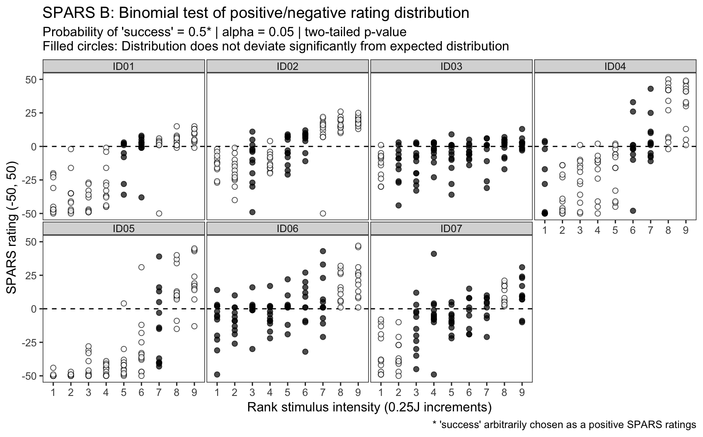
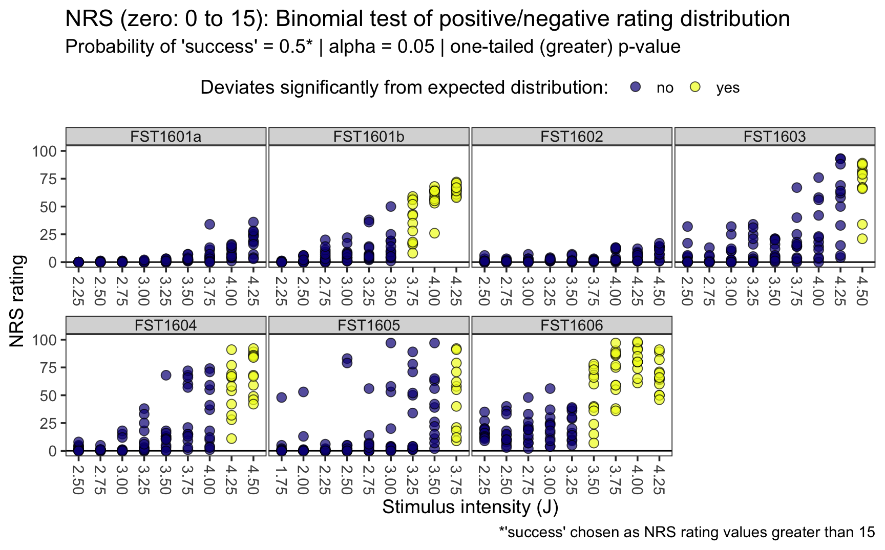

----

# Introduction

## Question
For each participant, and at each stimulus intensity, does the distribution of SPARS/NRS ratings differ significantly from a theoretical 'NULL' distribution?

## Methodology

We used the binomial test to assess this question. The binomial test is an exact test of the statistical significance of deviations from a theoretically expected distribution of observations into two categories. As such, using the test required that we dichotomize the continuous rating data we collected. 

The SPARS ranges from -50 ('no sensation') to +50 ('most intense pain you can imagine'), and therefore ratings can span 0 (pain threshold, 'the exact point at which you feel transitions to pain'). We therefore coded SPARS ratings < 0 as being **'negative'**, and ratings > 0 as being **'positive'**. In the first SPARS experiment (SPARS A), participants were not allowed to record a stimulus as 0 , but in the second SPARS experiment (SPARS B), they could record stimuli as 0 on the scale. We felt that the 0 ratings in the SPARS B experiment were uninformative, and so we excluded ratings of 0 from the analysis. 

The NRS ranges from 0 ('no pain') to 100 ('most intense pain you can imagine'), and therefore ratings immediately to the right of the 0-point of the scale mark the transition from non-painful to painful sensation. We therefore coded NRS ratings = 0 as being **'negative'**, and ratings > 0 as being **'positive'**. In addition, it has been reported that individuals use the first 15 points of a 0 to 100 NRS to record non-painful stimuli (NEEDS A REFERENCE), and so we also analysed the NRS data with NRS ratings $\leq$ 15 as being **'negative'**, and ratings >15 as being **'positive'**. 

In all cases, we modelled the data using the binomial test with a 50% probability of 'success' (positive rating arbitrarily chosen as success). This is a conservative approach as one would expect that for the SPARS and the NRS, as stimulus intensity increases above pain threshold, the probability of recording a 'positive' rating increases. Similarly, in the case of the SPARS (which allows the rating of intensity of noxious and non-noxious stimuli), one would expect that the probability of recording a 'negative' rating would increase. However, since we did not know the approximate intensity of a theshold stimulus, and there was high inter-individual variation in sensitivity, we were unable to gage at which stimulus intensities we should start shifting the probability of 'success' away from 50%. 

Because ratings on the SPARS can range from -50 to +50, we analysed the data using a two-tailed p-value. That is, the distribution may shift to the left or right of the theoretical distribution. However, because the NRS has a floor rating of 0 ('no pain'), the change in rating from 0 is unidirectional (> 0), so we performed the binomial test with a one-tailed p-value. For all test, significance was assessed at the $\alpha$ = 0.05 level. And, because this was an exploratory analysis, we did not make any family-wide corrections for multiple comparisons. 

----

# SPARS A

## Import and inspect data


```r
# Import
data <- read_rds('data/SPARS_A.rds')

# Inspect
glimpse(data)
```

```
## Observations: 1,823
## Variables: 6
## $ PID          <chr> "ID01", "ID01", "ID01", "ID01", "ID01", "ID01", "...
## $ block        <chr> "A", "A", "A", "A", "A", "A", "A", "A", "A", "A",...
## $ block_order  <dbl> 1, 1, 1, 1, 1, 1, 1, 1, 1, 1, 1, 1, 1, 1, 1, 1, 1...
## $ trial_number <dbl> 1, 2, 3, 4, 5, 6, 7, 8, 9, 10, 11, 12, 13, 14, 15...
## $ intensity    <dbl> 3.75, 1.50, 3.25, 1.50, 3.00, 2.75, 1.00, 2.25, 1...
## $ rating       <dbl> -10, -40, -10, -25, -20, -25, -40, 2, -40, -10, 4...
```

## Binomial test


```r
# Select columns
data %<>%
    select(PID, intensity, rating)

# Nest data by PID and stimulus intensity
data_nest <- data %>% 
    group_by(PID, intensity) %>% 
    nest() 

# Check number of repeats at each stimulus intensity
#data %>% 
#    group_by(PID, intensity) %>% 
#    summarise(repeats = n()) 

# Generate data
data_nest %<>% 
    # Add probability of success column
    mutate(prob = 0.5) %>% 
    # Extract rating data from dataframe
    mutate(data_vec = map(.x = data,
                          ~ .$rating)) %>% 
    # Recode rating data as categories according to sign
    mutate(data_cat = map(.x = data_vec,
                          ~ ifelse(.x < 0,
                                   yes = 'negative',
                                   no = 'positive'))) %>% 
    # Count the number of positive and negative ratings
    ## positive numbers arbitrarily listed first == 'success'
    mutate(success_count = map(.x = data_cat,
                           ~ c(length(.x[.x == 'positive']), 
                               length(.x[.x == 'negative'])))) %>% 
    # Conduct binomial test (two-sided)
    mutate(binomial_test = map2(.x = success_count,
                                .y = prob,
                                ~ binom.test(x = .x, 
                                             p = .y,
                                             alternative = 'two.sided'))) %>% 
    # Extract p-value from binomial_test
    mutate(binomial_p.value = map(.x = binomial_test,
                                 ~ .x$p.value %>%
                                     round(., 3))) %>% 
    # Categorise p-value using a p < 0.05 threshold
    ## Significant: distribution deviates significantly 
    ## from the theoretical distribution
    ## No correction for multiple comparisons 
    ## (too conservative for explorartory analysis)
    mutate(significant_p.value = map(.x = binomial_p.value,
                                     ~ ifelse(.x < 0.05,
                                              yes = 'yes',
                                              no = 'no')))
```

## Plot 

For each paticipant, we plotted raw SPARS ratings at each stimulus intensity and colour-coded the data according to whether the p-value returned by the binomial test was significant (distribution of data points deviates significantly from the theoretical expected distribution). 


```r
data_nest %>% 
    # Select data columns
    select(PID, intensity, significant_p.value) %>% 
    # Unnest data
    unnest() %>% 
    # Join with original data
    right_join(data) %>% 
    # Reclass intensity as an ordered factor
    mutate(intensity = factor(intensity, 
                              ordered = TRUE)) %>% 
    # Plot
    ggplot(data = .) +
    aes(x = intensity,
        y = rating,
        fill = significant_p.value) +
    geom_hline(yintercept = 0) +
    geom_point(colour = '#000000',
               shape = 21,
               size = 3,
               alpha = 0.7) + 
    labs(title = "SPARS A: Binomial test of positive/negative rating distribution",
         subtitle = "Probability of 'success' = 0.5* | alpha = 0.05 | two-tailed p-value",
         caption = "*'success' arbitrarily chosen as positive SPARS ratings",
         x = 'Stimulus intensity (J)',
         y = 'SPARS rating') +
    scale_x_discrete(breaks = seq(1, 4, by = 0.5),
                     labels = sprintf('%.2f', seq(1, 4, by = 0.5))) +
    scale_y_continuous(limits = c(-50, 50)) +
    scale_fill_viridis_d(name = 'Deviates significantly from expected distribution: ',
                         option = 'C') +
    scale_colour_viridis_d(name = 'Deviates significantly from expected distribution: ',
                           option = 'C') +
    facet_wrap(~ PID, 
               ncol = 4) +
    theme(legend.position = 'top',
          panel.grid = element_blank(),
          panel.spacing = unit(0.1, 'lines'),
          strip.text = element_text(margin = margin(t = 0.1, 
                                                    b = 0.1, 
                                                    r = 1, 
                                                    l = 1, 
                                                    'lines')),
          axis.text.x = element_text(angle = -90, 
                                     hjust = 0, 
                                     vjust = 0.5))
```


----

# SPARS B

## Import and inspect data


```r
# Import
data <- read_rds('data/SPARS_B.rds')

# Inspect
glimpse(data)
```

```
## Observations: 2,149
## Variables: 6
## $ PID          <chr> "FST1601a", "FST1601b", "FST1602", "FST1603", "FS...
## $ block        <int> 1, 1, 1, 1, 1, 1, 1, 1, 1, 1, 1, 1, 1, 1, 1, 1, 1...
## $ trial_number <int> 1, 1, 1, 1, 1, 1, 1, 2, 2, 2, 2, 2, 2, 2, 3, 3, 3...
## $ scale        <chr> "SPARS", "SPARS", "NRS", "SRS", "SRS", "SPARS", "...
## $ intensity    <dbl> 3.75, 2.75, 4.25, 3.00, 3.50, 2.50, 2.25, 4.00, 2...
## $ rating       <dbl> 3, 1, 9, -78, -32, 17, 27, 4, 5, 7, 0, -69, 9, 25...
```

## Binomial test


```r
# Select data
data %<>%
    # Extract trials rated using the SPARS
    filter(scale == 'SPARS') %>% 
    # Remove ratings of 0
    # Ratings of 0 are uninformative 
    filter(rating != 0) %>% 
    # Select columns
    select(PID, intensity, rating) 

# Check number of repeats at each stimulus intensity
data %>% 
    group_by(PID, intensity) %>% 
    summarise(repeats = n())
```

```
## # A tibble: 63 x 3
## # Groups:   PID [?]
##    PID      intensity repeats
##    <chr>        <dbl>   <int>
##  1 FST1601a      2.25      12
##  2 FST1601a      2.5       12
##  3 FST1601a      2.75      12
##  4 FST1601a      3         12
##  5 FST1601a      3.25       8
##  6 FST1601a      3.5       11
##  7 FST1601a      3.75       9
##  8 FST1601a      4         12
##  9 FST1601a      4.25      12
## 10 FST1601b      2.25      11
## # ... with 53 more rows
```

```r
# Nest data by PID and stimulus intensity
data_nest <- data %>% 
    group_by(PID, intensity) %>% 
    nest()

# Generate data
data_nest %<>% 
    # Add probability of success column
    mutate(prob = 0.5) %>% 
    # Extract rating data from dataframe
    mutate(data_vec = map(.x = data,
                          ~ .$rating)) %>% 
    # Recode rating data as categories according to sign
    mutate(data_cat = map(.x = data_vec,
                          ~ ifelse(.x < 0,
                                   yes = 'negative',
                                   no = 'positive'))) %>% 
    # Count the number of positive and negative ratings
    ## positive numbers arbitrarily listed first == 'success'
    mutate(success_count = map(.x = data_cat,
                           ~ c(length(.x[.x == 'positive']), 
                               length(.x[.x == 'negative'])))) %>% 
    # Conduct binomial test (two-sided)
    mutate(binomial_test = map2(.x = success_count,
                                .y = prob,
                                ~ binom.test(x = .x, 
                                             p = .y,
                                             alternative = 'two.sided'))) %>% 
    # Extract p-value from binomial_test
    mutate(binomial_p.value = map(.x = binomial_test,
                                 ~ .x$p.value %>%
                                     round(., 3))) %>% 
    # Categorise p-value using a p < 0.05 threshold
    ## Significant: distribution deviates significantly 
    ## from the theoretical distribution
    ## No correction for multiple comparisons 
    ## (too conservative for explorartory analysis)
    mutate(significant_p.value = map(.x = binomial_p.value,
                                     ~ ifelse(.x < 0.05,
                                              yes = 'yes',
                                              no = 'no')))
```

## Plot

For each paticipant, we plotted raw SPARS ratings at each stimulus intensity and colour-coded the data according to whether the p-value returned by the binomial test was significant (distribution of data points deviates significantly from the theoretical expected distribution). 


```r
data_nest %>% 
    # Select data columns
    select(PID, intensity, significant_p.value) %>% 
    # Unnest data
    unnest() %>% 
    # Join with original data
    right_join(data) %>% 
    # Reclass intensity as an ordered factor
    mutate(intensity = factor(intensity, 
                              ordered = TRUE)) %>% 
    # Plot
    ggplot(data = .) +
    aes(x = intensity,
        y = rating,
        fill = significant_p.value) +
    geom_hline(yintercept = 0) +
    geom_point(colour = '#000000',
               shape = 21,
               size = 3,
               alpha = 0.7) + 
    labs(title = "SPARS B: Binomial test of positive/negative rating distribution",
         subtitle = "Probability of 'success' = 0.5* | alpha = 0.05 | two-tailed p-value",
         caption = "*'success' arbitrarily chosen as positive SPARS ratings",
         x = 'Stimulus intensity (J)',
         y = 'SPARS rating') +
    scale_x_discrete(breaks = seq(1, 4.5, by = 0.25),
                     labels = sprintf('%.2f', seq(1, 4.5, by = 0.25))) +
    scale_y_continuous(limits = c(-50, 50)) +
    scale_fill_viridis_d(name = 'Deviates significantly from expected distribution: ',
                         option = 'C') +
    scale_colour_viridis_d(name = 'Deviates significantly from expected distribution: ',
                           option = 'C') +
    facet_wrap(~ PID, 
               ncol = 4,
               scales = 'free_x') +
    theme(legend.position = 'top',
          panel.grid = element_blank(),
          panel.spacing.x = unit(0.1, 'lines'),
          panel.spacing.y = unit(0.5, 'lines'),
          strip.text = element_text(margin = margin(t = 0.1, 
                                                    b = 0.1, 
                                                    r = 1, 
                                                    l = 1, 
                                                    'lines')),
          axis.text.x = element_text(angle = -90, 
                                     hjust = 0, 
                                     vjust = 0.5))
```



----

# NRS (zero: 0)

## Import and inspect data


```r
# Import
data <- read_rds('data/SPARS_B.rds')

# Inspect
glimpse(data)
```

```
## Observations: 2,149
## Variables: 6
## $ PID          <chr> "FST1601a", "FST1601b", "FST1602", "FST1603", "FS...
## $ block        <int> 1, 1, 1, 1, 1, 1, 1, 1, 1, 1, 1, 1, 1, 1, 1, 1, 1...
## $ trial_number <int> 1, 1, 1, 1, 1, 1, 1, 2, 2, 2, 2, 2, 2, 2, 3, 3, 3...
## $ scale        <chr> "SPARS", "SPARS", "NRS", "SRS", "SRS", "SPARS", "...
## $ intensity    <dbl> 3.75, 2.75, 4.25, 3.00, 3.50, 2.50, 2.25, 4.00, 2...
## $ rating       <dbl> 3, 1, 9, -78, -32, 17, 27, 4, 5, 7, 0, -69, 9, 25...
```

## Binomial test


```r
# Select data
data %<>%
    # Extract trials rated using the SPARS
    filter(scale == 'NRS') %>% 
    # Select columns
    select(PID, intensity, rating) 

# Check number of repeats at each stimulus intensity
#data %>% 
#    group_by(PID, intensity) %>% 
#    summarise(repeats = n())

# Nest data by PID and stimulus intensity
data_nest <- data %>% 
    group_by(PID, intensity) %>% 
    nest()

# Generate data
data_nest %<>% 
    # Add probability of success column
    mutate(prob = 0.5) %>% 
    # Extract rating data from dataframe
    mutate(data_vec = map(.x = data,
                          ~ .$rating)) %>% 
    # Recode rating data as categories according to whether 
    # the value is greater than 0 (minimum rating on NRS)
    mutate(data_cat = map(.x = data_vec,
                          ~ ifelse(.x == 0,
                                   yes = 'negative',
                                   no = 'positive'))) %>% 
    # Count the number of positive and negative ratings
    ## positive numbers arbitrarily listed first == 'success'
    mutate(success_count = map(.x = data_cat,
                           ~ c(length(.x[.x == 'positive']), 
                               length(.x[.x == 'negative'])))) %>% 
    # Conduct binomial test (two-sided)
    mutate(binomial_test = map2(.x = success_count,
                                .y = prob,
                                ~ binom.test(x = .x, 
                                             p = .y,
                                             alternative = 'greater'))) %>% 
    # Extract p-value from binomial_test
    mutate(binomial_p.value = map(.x = binomial_test,
                                 ~ .x$p.value %>%
                                     round(., 3))) %>% 
    # Categorise p-value using a p < 0.05 threshold
    ## Significant: distribution deviates significantly 
    ## from the theoretical distribution
    ## No correction for multiple comparisons 
    ## (too conservative for explorartory analysis)
    mutate(significant_p.value = map(.x = binomial_p.value,
                                     ~ ifelse(.x < 0.05,
                                              yes = 'yes',
                                              no = 'no')))
```

## Plot

For each paticipant, we plotted raw SPARS ratings at each stimulus intensity and colour-coded the data according to whether the p-value returned by the binomial test was significant (distribution of data points deviates significantly from the theoretical expected distribution). 


```r
data_nest %>% 
    # Select data columns
    select(PID, intensity, significant_p.value) %>% 
    # Unnest data
    unnest() %>% 
    # Join with original data
    right_join(data) %>% 
    # Reclass intensity as an ordered factor
    mutate(intensity = factor(intensity, 
                              ordered = TRUE)) %>% 
    # Plot
    ggplot(data = .) +
    aes(x = intensity,
        y = rating,
        fill = significant_p.value) +
    geom_hline(yintercept = 0) +
    geom_point(colour = '#000000',
               shape = 21,
               size = 3,
               alpha = 0.7) + 
    labs(title = "NRS (zero: 0): Binomial test of positive/negative rating distribution",
         subtitle = "Probability of 'success' = 0.5* | alpha = 0.05 | one-tailed (greater) p-value",
         caption = "*'success' chosen as NRS rating values greater than 0",
         x = 'Stimulus intensity (J)',
         y = 'NRS rating') +
    scale_x_discrete(breaks = seq(1, 4.5, by = 0.25),
                     labels = sprintf('%.2f', seq(1, 4.5, by = 0.25))) +
    scale_y_continuous(limits = c(0, 100)) +
    scale_fill_viridis_d(name = 'Deviates significantly from expected distribution: ',
                         option = 'C') +
    scale_colour_viridis_d(name = 'Deviates significantly from expected distribution: ',
                           option = 'C') +
    facet_wrap(~ PID, 
               ncol = 4,
               scales = 'free_x') +
    theme(legend.position = 'top',
          panel.grid = element_blank(),
          panel.spacing.x = unit(0.1, 'lines'),
          panel.spacing.y = unit(0.5, 'lines'),
          strip.text = element_text(margin = margin(t = 0.1, 
                                                    b = 0.1, 
                                                    r = 1, 
                                                    l = 1, 
                                                    'lines')),
          axis.text.x = element_text(angle = -90, 
                                     hjust = 0, 
                                     vjust = 0.5))
```


----

# NRS (zero: 0 to 15)

## Import and inspect data


```r
# Import
data <- read_rds('data/SPARS_B.rds')

# Inspect
glimpse(data)
```

```
## Observations: 2,149
## Variables: 6
## $ PID          <chr> "FST1601a", "FST1601b", "FST1602", "FST1603", "FS...
## $ block        <int> 1, 1, 1, 1, 1, 1, 1, 1, 1, 1, 1, 1, 1, 1, 1, 1, 1...
## $ trial_number <int> 1, 1, 1, 1, 1, 1, 1, 2, 2, 2, 2, 2, 2, 2, 3, 3, 3...
## $ scale        <chr> "SPARS", "SPARS", "NRS", "SRS", "SRS", "SPARS", "...
## $ intensity    <dbl> 3.75, 2.75, 4.25, 3.00, 3.50, 2.50, 2.25, 4.00, 2...
## $ rating       <dbl> 3, 1, 9, -78, -32, 17, 27, 4, 5, 7, 0, -69, 9, 25...
```

## Binomial test


```r
# Select data
data %<>%
    # Extract trials rated using the SPARS
    filter(scale == 'NRS') %>% 
    # Select columns
    select(PID, intensity, rating) 

# Check number of repeats at each stimulus intensity
#data %>% 
#    group_by(PID, intensity) %>% 
#    summarise(repeats = n())

# Nest data by PID and stimulus intensity
data_nest <- data %>% 
    group_by(PID, intensity) %>% 
    nest()

# Generate data
data_nest %<>% 
    # Add probability of success column
    mutate(prob = 0.5) %>% 
    # Extract rating data from dataframe
    mutate(data_vec = map(.x = data,
                          ~ .$rating)) %>% 
    # Recode rating data as categories according to whether 
    # the value is greater than 0 (minimum rating on NRS)
    mutate(data_cat = map(.x = data_vec,
                          ~ ifelse(.x <= 15,
                                   yes = 'negative',
                                   no = 'positive'))) %>% 
    # Count the number of positive and negative ratings
    ## positive numbers arbitrarily listed first == 'success'
    mutate(success_count = map(.x = data_cat,
                           ~ c(length(.x[.x == 'positive']), 
                               length(.x[.x == 'negative'])))) %>% 
    # Conduct binomial test (two-sided)
    mutate(binomial_test = map2(.x = success_count,
                                .y = prob,
                                ~ binom.test(x = .x, 
                                             p = .y,
                                             alternative = 'greater'))) %>% 
    # Extract p-value from binomial_test
    mutate(binomial_p.value = map(.x = binomial_test,
                                 ~ .x$p.value %>%
                                     round(., 3))) %>% 
    # Categorise p-value using a p < 0.05 threshold
    ## Significant: distribution deviates significantly 
    ## from the theoretical distribution
    ## No correction for multiple comparisons 
    ## (too conservative for explorartory analysis)
    mutate(significant_p.value = map(.x = binomial_p.value,
                                     ~ ifelse(.x < 0.05,
                                              yes = 'yes',
                                              no = 'no')))
```

## Plot

For each paticipant, we plotted raw SPARS ratings at each stimulus intensity and colour-coded the data according to whether the p-value returned by the binomial test was significant (distribution of data points deviates significantly from the theoretical expected distribution). 


```r
data_nest %>% 
    # Select data columns
    select(PID, intensity, significant_p.value) %>% 
    # Unnest data
    unnest() %>% 
    # Join with original data
    right_join(data) %>% 
    # Reclass intensity as an ordered factor
    mutate(intensity = factor(intensity, 
                              ordered = TRUE)) %>% 
    # Plot
    ggplot(data = .) +
    aes(x = intensity,
        y = rating,
        fill = significant_p.value) +
    geom_hline(yintercept = 0) +
    geom_point(colour = '#000000',
               shape = 21,
               size = 3,
               alpha = 0.7) + 
    labs(title = "NRS (zero: 0 to 15): Binomial test of positive/negative rating distribution",
         subtitle = "Probability of 'success' = 0.5* | alpha = 0.05 | one-tailed (greater) p-value",
         caption = "*'success' chosen as NRS rating values greater than 15",
         x = 'Stimulus intensity (J)',
         y = 'NRS rating') +
    scale_x_discrete(breaks = seq(1, 4.5, by = 0.25),
                     labels = sprintf('%.2f', seq(1, 4.5, by = 0.25))) +
    scale_y_continuous(limits = c(0, 100)) +
    scale_fill_viridis_d(name = 'Deviates significantly from expected distribution: ',
                         option = 'C') +
    scale_colour_viridis_d(name = 'Deviates significantly from expected distribution: ',
                           option = 'C') +
    facet_wrap(~ PID, 
               ncol = 4,
               scales = 'free_x') +
    theme(legend.position = 'top',
          panel.grid = element_blank(),
          panel.spacing.x = unit(0.1, 'lines'),
          panel.spacing.y = unit(0.5, 'lines'),
          strip.text = element_text(margin = margin(t = 0.1, 
                                                    b = 0.1, 
                                                    r = 1, 
                                                    l = 1, 
                                                    'lines')),
          axis.text.x = element_text(angle = -90, 
                                     hjust = 0, 
                                     vjust = 0.5))
```



----

## Session information


```r
sessionInfo()
```

```
## R version 3.5.1 (2018-07-02)
## Platform: x86_64-apple-darwin15.6.0 (64-bit)
## Running under: macOS High Sierra 10.13.6
## 
## Matrix products: default
## BLAS: /Library/Frameworks/R.framework/Versions/3.5/Resources/lib/libRblas.0.dylib
## LAPACK: /Library/Frameworks/R.framework/Versions/3.5/Resources/lib/libRlapack.dylib
## 
## locale:
## [1] en_GB.UTF-8/en_GB.UTF-8/en_GB.UTF-8/C/en_GB.UTF-8/en_GB.UTF-8
## 
## attached base packages:
## [1] stats     graphics  grDevices utils     datasets  methods   base     
## 
## other attached packages:
##  [1] bindrcpp_0.2.2  magrittr_1.5    forcats_0.3.0   stringr_1.3.1  
##  [5] dplyr_0.7.6     purrr_0.2.5     readr_1.1.1     tidyr_0.8.1    
##  [9] tibble_1.4.2    ggplot2_3.0.0   tidyverse_1.2.1
## 
## loaded via a namespace (and not attached):
##  [1] Rcpp_0.12.18      cellranger_1.1.0  pillar_1.3.0     
##  [4] compiler_3.5.1    plyr_1.8.4        bindr_0.1.1      
##  [7] tools_3.5.1       digest_0.6.15     viridisLite_0.3.0
## [10] lubridate_1.7.4   jsonlite_1.5      evaluate_0.11    
## [13] nlme_3.1-137      gtable_0.2.0      lattice_0.20-35  
## [16] pkgconfig_2.0.1   rlang_0.2.1       cli_1.0.0        
## [19] rstudioapi_0.7    yaml_2.2.0        haven_1.1.2      
## [22] withr_2.1.2       xml2_1.2.0        httr_1.3.1       
## [25] knitr_1.20        hms_0.4.2         rprojroot_1.3-2  
## [28] grid_3.5.1        tidyselect_0.2.4  glue_1.3.0       
## [31] R6_2.2.2          fansi_0.2.3       readxl_1.1.0     
## [34] rmarkdown_1.10    modelr_0.1.2      backports_1.1.2  
## [37] scales_0.5.0.9000 htmltools_0.3.6   rvest_0.3.2      
## [40] assertthat_0.2.0  colorspace_1.3-2  labeling_0.3     
## [43] utf8_1.1.4        stringi_1.2.4     lazyeval_0.2.1   
## [46] munsell_0.5.0     broom_0.5.0       crayon_1.3.4
```
